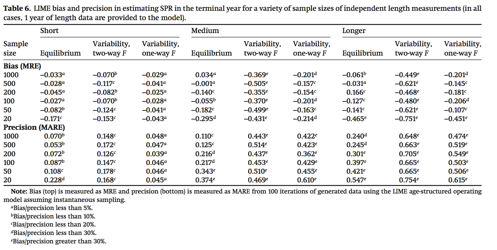

```{r setup, include=FALSE}
options(htmltools.dir.version = FALSE)
knitr::opts_chunk$set(echo = FALSE, message = FALSE, warning = FALSE,
                      dev = "svg", fig.width = 8,
                      fig.height = 4.5)
```

class: inverse, center, middle

# Scrooge

```{r}
library(hrbrthemes)
library(extrafont)
library(scales)
library(rstan)
library(tidyverse)
library(wesanderson)
extrafont::loadfonts()
rstan::rstan_options(auto_write = TRUE)


  scrooge_theme <- theme_ipsum(base_size = 14, axis_title_size = 18)

  theme_set(scrooge_theme)

load(here::here("processed_data","fisheries_sandbox.Rdata"))

# load(here::here("presentations","gaines-lab.Rdata"))

  functions <- list.files(here::here("functions"))

  walk(functions, ~ here::here("functions", .x) %>% source()) # load local functions

  in_clouds <-  F

  run_name <- "v3.0"
  
    scrooge_theme <- theme_ipsum(base_size = 14, axis_title_size = 18)

  theme_set(scrooge_theme)
  
  load(file = here::here("presentations","gaines-lab.Rdata"))

```

---

# Data-limited assessments - so hot right now!

We'll define as fisheries lacking enough information for a "traditional" stock assessment (i.e. contrast and scale)

Two broad classes

- Catch-based

  - Trends in catches ~ F, size ~ MSY

  - DB-SRA, C-MSY, CC-SRA, SSCOM, ORCS,PRM
  
- Length-based

  - LBSPR, catch curves, mean length, L~opt~, LIME
  
All trade data for assumptions, and nearly all are completely focused on biological data

---

# Introducing.... Scrooge!

**Can economic data improve fisheries stock assessment?**

- Economic data can be resurrected where biological cannot

- Fisheries can be data-limited but knowledge rich

- Hypothesis: data (formal or informal) on the economic history of a fishery can inform fishery status


---

# What's the Problem?

- Catch-based methods 
  - Require complete catch history, or at least perfectly representative catch history
    - Fun fact: underpreporting makes you more conservative!
  - Usually large-scale or developed world "data-limited" solution
---

# That's the Problem?


---


# What's the Problem


- Length-based methods
  - Cheap, representative sampling works
  - "work" with just 1 sample!
  - Intuitive to use (are you catching lots of small fish? If yes, stop)

But....

- Recruitment and fishing look the same
- Neet to be really good at translating length to age
- Dome shaped selectivity is a killer
- Time varying life history is no bueno

---

# What's the Problem

```{r}
r_lengths
```

---

# What's the Problem

```{r}
f_lengths
```

---

# What's the solution


- We spend a *lot* of effort trying to scape more knowledge out of less data

> *I feel thin... like butter scraped over too much bread* - B. Baggins

--


--

- Let's get more data!

  - Easier said than done
  - What about economics?

---

# Scrooge

Enter `scrooge`!

<p align="center-top">


--

- Fisheries are the intersection of human incentives and marine ecology

- Economics tells us how people respond to incentives (supposedly)

---

# Scrooge

The basic idea:

- We have economic theory about how fisheries work
  - More profits ~ more effort
    - Open access
  - Effort ~ mortality

Assertion: Economic data is easier to recover than biological data
- How many people have been fishing around here?
- What size of fish do you usually catch?
- How has your fishing technology changed?
- How has the market changed?

---

#Scrooge

### Broad Methods

- Focus on length-based assessment for now

- Building off of LBSPR and LIME 
  - Estimate time series of fishing mortality, selectivity, and recruitment

- Fishing mortality and recruitment are highly confounded
  - estimating both is hard
  - LBSPR: Assume equilibrium
  - LIME: F this year is similar to F last year, voodoo?
  
- Scrooge solution: informative priors on F based on economic data / data indicative of F
  

---


# Scrooge

- Data are length compositions over time
  - Effort history?

- Life history drawn from literature (`FishLife`) or local knowledge

- Data on relative historic prices, costs, and technology 

- Data (or priors?) on relative effort

- Profit per unit effort

- Estimate

  - Vector of recruitment (mean BH, life history informed $\sigma$)
  - Vector of F (economic priorts)
  - Selectivity (priors from local knowledge)
  - Fit to length composition data

---


#Scrooge
## Economic Priors

- Structural

  - Estimate "effort deviates" from open-access bioeconomic model
  
  - $\hat{effort_{t}} \sim (\hat{effort_{t - 1}} + \theta{profits_{t - 1}}) + normal(0,\sigma_{effort})$

  - $effort_{t} \sim normal(\hat{effort_{t}}. sigma_{effort}^{obs})$
    
- Naive

  - $effort_{t} \sim normal(effort_{t - 1}, \sigma_{effort})$
  
More to come!

---

# Scrooge

Testing Steps

- Use `SPASM` to simulate fisheries under different life history, fleet dynamics, and observation error

- Fit scrooge versions, LBSPR, and LIME to data

- Compare accuracy and bias

- Utilize regression, multidimensional scaling, and machine learning to estimate factors affecting performance

- If appropriate, use scrooge on PISCO/Montserrat data


---

# How does it work?
## Perfect Conditions

```{r}

easy$lcomps[[1]]$length_fit_plot

```


---

# How does it work?
## Perfect Conditions

```{r}

easy$scrooge_performance[[1]]$comparison_plot +
  lims(x = c(60, NA))

```

---

# Scrooge
## Tougher Conditions


```{r}
medium$lcomps[[1]]$length_fit_plot

```

---

# Scrooge
## Tougher Conditions

```{r}

medium$scrooge_performance[[1]]$comparison_plot +
  lims(x = c(64, NA)) + 
  labs(y = "Fishing Mortality")

```

---

# Scrooge
## Model Totally Wrong

```{r}
toughest$lcomps[[1]]$length_fit_plot
```

---

# Toughest

```{r}
toughest$scrooge_performance[[1]]$comparison_plot
```


---

# How Much Does it Help?


```{r}
helps_plot
```

---

# How Much Does it Hurt?

Econ vs non-econ when things are not econy

```{r}
hurts_plot
```


---

# How does it Compare?


# When Does it Work?

What I want to avoid:



---

# When Does it Work?

Where I want to get to:

H0: Assessment performances are too complex and non-linear for "grid performance"

- Obvious cases are easy (Can't use LBSPR if can't associate length and ages)

- Non-obvious aren't (Is my fishery's recruitment "too" autocorrelated?)

Solution: Machine learning to predict performance

---

# When Does it Work?

Machine learning to predict performance

- Develop (massive) training library using `spasm` (mostly done)

- Let `scrooge` loose on it

- Pick metrics of interest (rmse, bias)

- Train model predicting metric as a function of fishery characteristics

---

# When Does it Work?

Once predictive model trained

- For new fisheries

  - Score according to similarity to fisheries in training data
  - Warn if extremely dissimilar
  
  - Produce predicted performance score for fishery based
  on measurable proxies for model characteristics 
  
    - "We've used the same technology for the last 10 years"
    - "We notice periods when lots of small fish show and periods when they don't"
    
    - "This species is large and grows slowly"

---

# Scrooge
## Next Steps

- Test treating effort knowledge as prior/data

- Test usefulness of profit-per-unit-effort

- Refine prior choices (really matter)

- Burn down a few servers

## Long-term

- Framework for economic data, and Bayesian priors in general, in DLA

- Integration to stock synthesis


---

