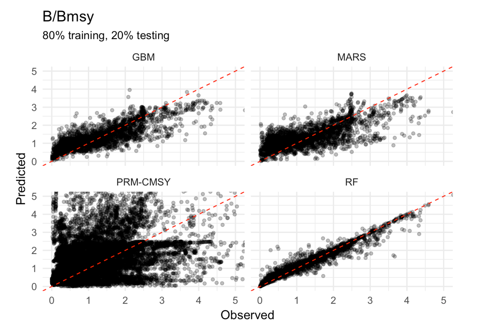
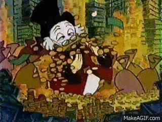

```{r setup, include=FALSE}
options(htmltools.dir.version = FALSE)
knitr::opts_chunk$set(echo = FALSE, message = FALSE, warning = FALSE,
                      dev = "svg", fig.width = 8,
                      fig.height = 4.5)
```

class: inverse, center, middle

# Scrooge

```{r}
library(hrbrthemes)
library(extrafont)
library(scales)
library(rstan)
library(tidyverse)
extrafont::loadfonts()

  scrooge_theme <- theme_ipsum(base_size = 14, axis_title_size = 18)

  theme_set(scrooge_theme)

load(here::here("processed_data","fisheries_sandbox.Rdata"))

load(here::here("presentations","gaines-lab.Rdata"))

```

---

# Data-limited assessments - so hot right now!

We'll define as fisheries lacking enough information for a "traditional" stock assessment (i.e. catches + cpue)

Two broad classes

- Catch-based

  - Trends in catches ~ F, size ~ MSY

  - DB-SRA, C-MSY, CC-SRA, SSCOM, ORCS,PRM
  
- Length-based

  - LBSPR, catch curves, mean length, L~opt~, LIME
  
All trade data for assumptions, and nearly all are completely focused on biological data

---

# Introducing.... Scrooge!

**Can economic data improve fisheries stock assessment?**

- Economic data can be resurrected where biological cannot

- Fisheries can be data-limited but knowledge rich

- Hypothesis: data (formal or informal) on the economic history of a fishery can inform fishery status


---

# What's the Problem?

- Catch-based methods 
  - Require complete catch history, or at least perfectly representative catch history
    - Fun fact: underpreporting makes you more conservative!
  - Usually large-scale or developed world "data-limited" solution




---


# What's the Problem


- Length-based methods
  - Cheap, representative sampling works
  - "work" with just 1 sample!
  - Intuitive to use (are you catching lots of small fish? If yes, stop)

But....

- Recruitment and fishing look the same
- Neet to be really good at translating length to age
- Dome shaped selectivity is a killer
- Time varying life history is no bueno

---

# What's the Problem

Show simulation with just autocorrelated recruitment variation and just  AC F variation

---

# What's the solution


- We spend a *lot* of effort trying to scape more knowledge out of less data

> I feel thin... like butter scraped over too much bread - B. Baggins

--


--

- Let's get more data!

  - Easier said than done
  - What about economics?

---

# Scrooge

Enter `scrooge`!



--

- Fisheries are the intersection of human incentives and marine ecology

- Economics tells us how people respond to incentives (supposedly)

---

# Scrooge

The basic idea:

- We have economic theory about how fisheries work
  - More profits ~ more effort
    - Open access
  - Effort ~ mortality

Assertion: Economic data is easier to recover than biological data
- How many people have been fishing around here?
- What size of fish do you usually catch?
- How has your fishing technology changed?
- How has the market changed?

---

#Scrooge

### Broad Methods

- Focus on length-based assessment for now

- Building off of LBSPR and LIME 
  - Estimate time series of fishing mortality, selectivity, and recruitment

- Fishing mortality and recruitment are highly confounded
  - estimating both is hard
  - LBSPR: Assume equilibrium
  - LIME: F this year is similar to F last year, voodoo?
  
- Scrooge solution: informative priors in F based on economic data
  

---

# Scrooge

Equations showing hierarchichal nature of model 

---

# Scrooge

- Data are length compositions over time
  - Effort history?

- Life history drawn from literature (`FishLife`) or local knowledge

- Data on relative historic prices, costs, and technology 

- Estimate

  - Vector of recruitment (mean BH, life history informed $\sigma$)
  - Vector of F (economic priorts)
  - Selectivity (priors from local knowledge)
  - Fit to length composition data

---


#Scrooge
## Economic Priors

- Structural

  - Estimate "effort deviates" from open-access bioeconomic model
  
  - $effort_{t} \sim (effort_{t - 1} + \theta{profits_{t - 1}})e^{normal(0,\sigma_{effort})}$

    ** Show MSY scaling
    
- Naive

  - $effort_{t} \sim normal(effort_{t - 1}, \sigma_{effort})$
  
More to come!

---

# Scrooge

Testing Steps

- Use `SPASM` to simulate fisheries under different life history, fleet dynamics, and observation error

- Fit scrooge versions, LBSPR, and LIME to data

- Compare accuracy and bias

- Utilize regression, multidimensional scaling, and machine learning to estimate factors affecting performance

- If appropriate, use scrooge on PISCO/Montserrat data


---

```{r, eval = F}

length_data <- read_csv(here::here("ahnold","data","UCSB_FISH raw thru 2013.csv")) %>%
  magrittr::set_colnames(., tolower(colnames(.))) %>%
  mutate(classcode = tolower(classcode)) %>%
  mutate(observer = ifelse(is.na(observer), 'unknown', observer))

life_history_data <-
  read_csv(here::here(
    "ahnold",
    'data',
    'VRG Fish Life History in MPA_04_08_11_12 11-Mar-2014.csv'
  )) %>%
  rename(classcode = pisco_classcode) %>%
  mutate(classcode = tolower(classcode)) %>%
  magrittr::set_colnames(., tolower(colnames(.)))

fish_life <-
  life_history_data$taxa %>% str_split(' ', simplify = T) %>%
  as_data_frame() %>%
  select(1:2) %>%
  set_names(c('genus', 'species'))

get_fish_life <- function(genus, species) {
  Predict = Plot_taxa(
    Search_species(Genus = genus, Species = species)$match_taxonomy,
    mfrow = c(2, 2),
    partial_match = T,
    verbose = F
  )
  out <- Predict[[1]]$Mean_pred %>%
    as.matrix() %>%
    t() %>%
    as.data.frame()

  out[colnames(out) != 'Temperature'] <-
    exp(out[colnames(out) != 'Temperature'])

  return(out)

}

fish_life <- fish_life %>%
  mutate(life_traits = map2(genus, species, safely(get_fish_life)))

fish_life <- fish_life %>%
  mutate(fish_life_worked = map(life_traits, 'error') %>% map_lgl(is.null)) %>%
  filter(fish_life_worked) %>%
  mutate(life_traits = map(life_traits, 'result')) %>%
  unnest() %>%
  mutate(taxa = glue::glue('{genus} {species}')) %>%
  set_names(tolower)

life_history_data <- life_history_data %>%
  left_join(fish_life, by = 'taxa')


length_data <- length_data %>% 
  left_join(life_history_data, by = "classcode")

brock_life <- length_data %>% 
  filter(commonname == "blue rockfish")

brock <- length_data %>% 
  filter(commonname == "blue rockfish") %>% 
  select(year, fish_tl, count) %>% 
  group_by(year, fish_tl) %>% 
  summarise(numbers = sum(count)) %>% 
  group_by(year) %>% 
  mutate(scaled_numbers = numbers / sum(numbers))

brock %>% 
  ggplot(aes(fish_tl, year, height = scaled_numbers, group = year)) + 
  geom_density_ridges(stat = "identity")

brock_comps <- brock %>% 
  select(year, fish_tl, numbers) %>% 
  spread(fish_tl, numbers, fill = 0)

prict_t <- matrix(1,nrow = nrow(brock_comps), ncol = 2)

cost_t <- matrix(1,nrow = nrow(brock_comps), ncol = 2)

q_t <- matrix(.1,nrow = nrow(brock_comps), ncol = 2)

scrooge_data <- list(
      economic_model = 1,
      estimate_recruits = 1,
      length_comps = brock_comps %>% select(-year),
      length_comps_years  = brock_comps$year,
      price_t = price_t,
      cost_t = cost_t,
      q_t = q_t,
      beta = 1.3,
      # base_effort = fish$m / mean(q_t$value),
      length_50_sel_guess = 20,
      delta_guess = 2,
      n_lcomps = nrow(brock_comps),
      nt = length(brock_comps$year),
      n_ages = fish$max_age + 1,
      n_lbins = ncol(length_at_age_key),
      ages = 1:(fish$tmax + 1),
      mean_length_at_age = fish$length_at_age,
      mean_weight_at_age = fish$weight_at_age,
      mean_maturity_at_age = fish$maturity_at_age,
      m = fish$m,
      h = fish$steepness,
      r0 = fish$r0,
      k = fish$vbk,
      loo = fish$linf,
      t0 = fish$t0,
      length_at_age_key = as.matrix(length_at_age_key)
    )


```

# How does it work?
## Perfect Conditions

```{r}

easy$lcomps[[1]]$length_fit_plot

```


---

# How does it work?
## Perfect Conditions

```{r}

easy$scrooge_performance[[1]]$comparison_plot +
  lims(x = c(60, NA))

```

---

# Scrooge
## Tougher Conditions


```{r}
medium$lcomps[[1]]$length_fit_plot

```

---

# Scrooge
## Tougher Conditions

```{r}

medium$scrooge_performance[[1]]$comparison_plot +
  lims(x = c(64, NA)) + 
  labs(y = "Fishing Mortality")

```

---

# Scrooge
## Model Totally Wrong

```{r}
toughest$lcomps[[1]]$length_fit_plot
```

---

# Toughest

```{r}
toughest$scrooge_performance[[1]]$comparison_plot
```


---

# How Much Does it Help?


Econ vs non-econ when things are econy

---

# How Much Does it Hurt?

Econ vs non-econ when things are not econy

---

# How does it Compare?

# Scrooge
## Next Steps

- Refine economic operating model

- Fine tune economic priors

- Burn down a few servers

## Long-term

- Framework for economic data, and Bayesian priors in general, in DLA

- Integration to stock synthesis


---

