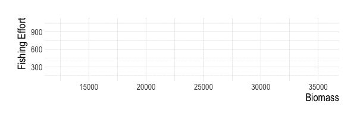
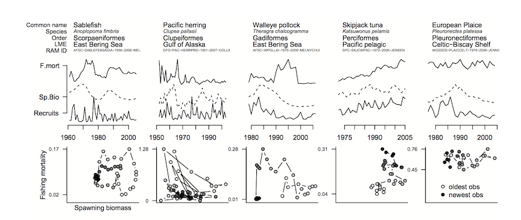

```{r setup, include=FALSE}
options(htmltools.dir.version = FALSE)
knitr::opts_chunk$set(echo = FALSE, message = FALSE, warning = FALSE,
                      dev = "svg", fig.width = 9,
                      fig.height = 6)
```


# What's the Problem?

```{r}
library(hrbrthemes)
library(extrafont)
library(scales)
library(rstan)
library(tidyverse)
library(wesanderson)
library(patchwork)
extrafont::loadfonts()
rstan::rstan_options(auto_write = TRUE)


  scrooge_theme <- theme_ipsum(base_size = 14, axis_title_size = 18)

  theme_set(scrooge_theme)

load(here::here("processed_data","fisheries_sandbox.Rdata"))

# load(here::here("presentations","gaines-lab.Rdata"))

  functions <- list.files(here::here("functions"))

  walk(functions, ~ here::here("functions", .x) %>% source()) # load local functions

  in_clouds <-  F

  run_name <- "v3.0"
  
    scrooge_theme <- theme_ipsum(base_size = 14, axis_title_size = 18)

  theme_set(scrooge_theme)
  
  load(file = here::here("presentations","seagrant-presentation.Rdata"))

```

- It's hard to manage what you can't count

- Counting fish requires data

- Most fisheries lack resources for "traditional" assessment

- Little data and lots of need creates demand for DLAs

  - C-MSY
  - DB-SRA
  - LIME
  - LBSPR
  - The list goes on

So, we're good?

---

# Why Another DLA?

- All DLAs trade data for assumptions

- We spend a *lot* of effort trying to scrape more knowledge out of less data

> *I feel thin... like butter scraped over too much bread* - B. Baggins

--
<p align="center-top">


---

# What's the Solution?

- Just get more data!
  
- Easier said than done...

  - Hard to measure eaten fish
  
  - New data can take time to pay off
  
- What about economic data?

  - Economic data can be resurrected where biological cannot

  - Fisheries can be data-limited but knowledge rich

---

# What Do Economic Data Tell Us?

- Fisheries are coupled economic-ecological systems

  - Fishermen respond to incentives provided by society and species
 
  - Species respond to actions of fishermen, modifying incentives

- Assertion: Profits make up a substantial part of incentives

- Data on the incentive history of a fishery provide clues to its status

- Economic behavior increasingly incorporated in MSE
---

# The Basic Idea

- We have economic theory about how fisheries work
  - More profits ~ more effort
  
  - Effort ~ mortality

- Economic data are easier to recover than biological data
  - How many people have been fishing around here?
  
  - What size of fish do you usually catch?
  
  - How has your fishing technology changed?
  
  - How has the market changed?

---

# What Does Theory Tell Us?

- Gordon (1954)
  - Fishermen respond to profits
  - Open access leads to zero profits

$$effort_{t} = effort_{t - 1} + \theta{profits_{t-1}}$$

<p align="center">



- More advanced models: same basic idea, more levers

  - Game theory
  - Random utility models 
  - Agent based models


---

# What Evidence Is there?



.footnote[
Szuwalski & Thorson 2017 - *Global fishery dynamics are poorly predicted by classical models*
]
---

# Introducing `scrooge`

## Core Philosphy:

  > *Integrate historic economic data (effort, prices, costs, technology) into stock assessment*
  
## Initial Application

  - Build off of length-based methods (and LIME framework)

  - Why start with lengths?
   
    - Recruitment and F tough to disentangle
   
    - SR relationships inform recruitment
   
    - Economics inform F?

---

# Who's Driving the Bus?

```{r}
(r_lengths + labs(x = "")) + (f_lengths + labs(title = '', y = '')) + plot_layout(ncol = 2)
```

---

#`Scrooge`

- Builds off of LIME structure (Rudd & Thorson 2017)

  - Age structured, "mixed effects" (or hierarchical here)

- With just length data, estimate

  - Selectivity
  
  - *t* recruitment events $r_{t}$
  
  $$r_{t} \sim BH(SSB,SSB_{0},h)e^{r^{dev}_{t} -\sigma_r^{2}/2}$$
  $$r^{dev}_{t} \sim normal(0, \sigma_r)$$

  - *t* fishing mortalities $f_{t}$

  - LIME: 
 
 $$f_{t} \sim normal(f_{t-1},\sigma_{f})$$

---

#`Scrooge`

- Effort history ("Effort is about twice what it used to be")

$$\Delta_{t}^{effort} = \frac{effort_{t+1}}{effort_{t}}$$

$$\hat{effort_{t}}^{data} = effort_{t-1}\Delta_{t-1}$$
  
- Incentives history ("prices went up a lot the last few years")

$$p_t = p_{base}\frac{p^{obs}_t}{\bar{p^{obs}}}$$

$$\Pi_{t} \sim p_{t}q_{t}E_{t}B^{c}_{t} - c_{t}E_{t}^{\beta}$$

$$\hat{effort_{t}}^{econ} = effort_{t-1} + effort_{msy}(\theta\frac{\Pi_{t-1}}{\Pi_{msy}})$$

- Expected effort is then...

$$effort_t \sim normal((\alpha)\hat{effort_{t}}^{econ} + (1 - \alpha)\hat{effort_{t}}^{data},\sigma_{f})$$

---

#`Scrooge`

In words...

- Simulate fisheries using `spasm`
  - Effort dynamics, recruitment regimes, observation error, etc.

- Collect length comps and economic data from simulated fisheries
  - Percent changes in in effort
  - mean deviations in price, cost, tech

- Life history from `FishLife`

- Fit data using `scrooge`
  - "LIME" prior
  - Bioeconomic model only
  - Effort history only
  
- Assess performance
  - How much does it help/hurt?
  - Compared to LBSPR/LIME?

---

# How Much Does it Help?

```{r}
helps_plot
```


---

# How Much Does it Hurt?

```{r}
hurts_plot
```


---

# How Does it Compare


```{r}
model_trends_plot + 
  ggsci::scale_fill_npg() + 
    ggsci::scale_color_npg()

```


---


# When Does it Work?

- Assessment performance depends on complex set of non-linear dynamics

- Hard for stakeholders to parse massive tables of RMSE

- Proposed solution: *Predictive algorithm for model performance*

  - Currently running 100,000's of `scrooge` simulations
  
  - Calculate metric of interest (RMSE, bias, etc.)
  
  - Train predictive algorithm (MARS, random forest)
  
- For new fisheries
  
  - Assess similarity to training set
  
  - Predict performance metric if appropriate

---

# When Does it Work?


```{r}
rmse_plot
```

---

# When Does it Work?

```{r}
bias_plot
```

---

# When Does it Work?

```{r}
varimp_plot
```


---

#  Economic Data are Underutilized 

- Economic data show potential to improve stock assessment

  - Incorporates local knowledge where data is limited
  
- Technology will increase ability to collect economic data

  - Mobile phones
  
  - Global fishing watch
  
- But... 

  - When it's wrong, how wrong is it?
  
  - Need empirical data to test

---


# Ongoing Work

- Integrate demand dynamics

- Assemble testing library

- Test and diagnose performance

- Test against "traditional" stock assessment

- Catch estimation from total effort

- Apply to case study fisheries

  - Channel Islands
  
  - Peru
  
  - Montserrat

---

class: center

# Thanks!

###Collaborators
- Jason Cope
- Merrill Rudd
- Ray Hilborn
- Chris Costello
- Steve Gaines

###Funding
- NMFS Sea Grant Population and Ecosystem Dynamics Fellowship
###Contact
**email**: dovando@bren.ucsb.edu
**github**: DanOvando
**website**: [weirdfishes.blog](http://www.weirdfishes.blog)

---

# Extras

```{r}
scrooge_pred_rmse_plot +
  theme(axis.text.x = element_text(size = 8))
 
```

---
